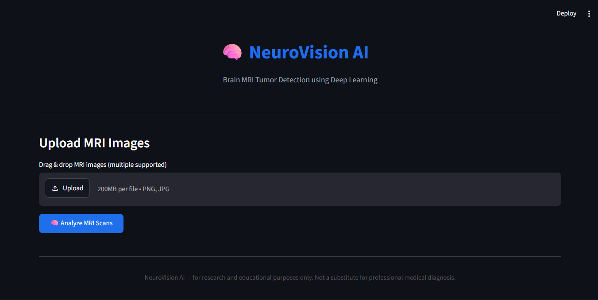
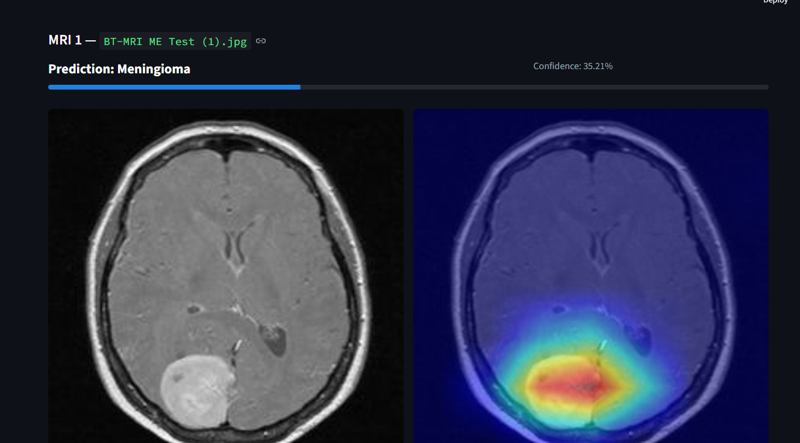
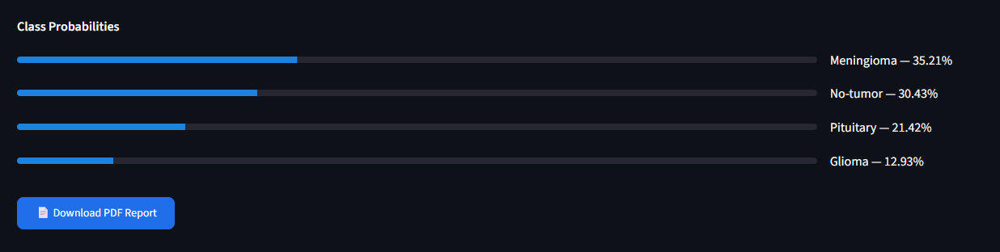
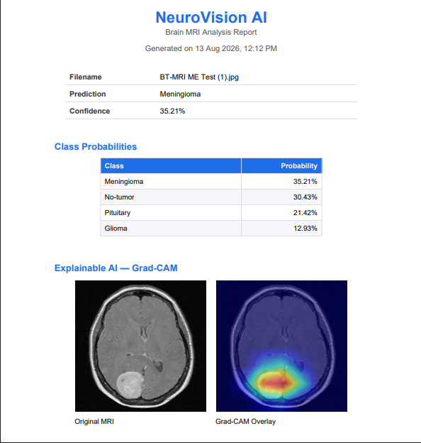

<div align="center">

# 🧠 NeuroVision AI

### Brain MRI Tumor Detection using Deep Learning & Explainable AI

An end-to-end deep learning application that classifies brain MRI scans into four categories — **Glioma, Meningioma, Pituitary Tumor, and No Tumor** — using an **EfficientNet-B0** classifier, visualizes model decisions with **Grad-CAM**, and generates downloadable **PDF diagnostic reports**, all through a single-page **Streamlit** dashboard.

[](https://www.python.org/)
[](https://pytorch.org/)
[](https://streamlit.io/)
[](https://opencv.org/)
[](LICENSE)
[]()

</div>

---

## 📖 Table of Contents

- [Overview](#-overview)
- [Why This Project](#-why-this-project)
- [Features](#-features)
- [Demo](#️-demo)
- [System Architecture](#️-system-architecture)
- [Tech Stack](#-tech-stack)
- [Project Structure](#-project-structure)
- [Installation](#️-installation)
- [Usage](#-usage)
- [How It Works](#-how-it-works)
- [Model Details](#-model-details)
- [Explainable AI — Grad-CAM](#-explainable-ai--grad-cam)
- [PDF Report Generation](#-pdf-report-generation)
- [Results](#-results)
- [Roadmap](#-roadmap--version-2)
- [Challenges & Learnings](#-challenges--learnings)
- [Limitations](#️-limitations)
- [Author](#-author)
- [License](#-license)

---

## 📌 Overview

NeuroVision AI is a computer-aided diagnosis (CAD) tool built to assist in the preliminary screening of brain MRI scans.

A user uploads one or more MRI images through a web dashboard, and the system returns:

- The **predicted tumor class** with a confidence score
- A **full probability breakdown** across all four classes:
  - Glioma
  - Meningioma
  - Pituitary
  - No Tumor
- A **Grad-CAM heatmap** highlighting the region of the scan that contributed most strongly to the model's decision
- A **downloadable PDF report** summarizing the scan, prediction, confidence, probability distribution, and visual explanation

The project was built to go beyond a typical "train a CNN in a notebook and report accuracy" exercise. It covers the complete pipeline:

**Data preprocessing → Model training → Inference → Explainability → Web Interface → PDF Reporting**

> ⚠️ **Disclaimer:** This project is for educational and research purposes only. It is **not a certified medical diagnostic tool** and must never be used as a substitute for professional medical advice, diagnosis, or treatment.

---

## 🎯 Why This Project

Brain tumors are among the most critical conditions to detect early, and MRI is an important imaging modality used during diagnosis.

This project explores how deep learning can:

- Act as a **fast and consistent preliminary screening aid**
- Reduce the "black box" problem in medical AI through **Grad-CAM explainability**
- Provide visual insight into the regions influencing a model's prediction
- Package a trained deep learning model into an application that can be used through a web interface
- Generate structured reports that combine prediction results with model explanations

Rather than stopping at model training, NeuroVision AI focuses on building a complete AI application from **image input to interpretable output**.

---

## ✨ Features

| Category | Details |
|---|---|
| 🧠 **Core AI** | EfficientNet-B0 classifier using transfer learning · 4-class prediction · Confidence and full probability scores |
| 🔥 **Explainable AI** | Grad-CAM heatmap generation · Original MRI and AI-focus visualization |
| 🌐 **Dashboard** | Single-page Streamlit UI · Multi-image batch upload · Dark interface · Progress indicators |
| 📄 **Reporting** | Automatically generated per-scan PDF report with prediction, confidence, probabilities, and Grad-CAM visualization |
| 🗂️ **Architecture** | Modular codebase separating prediction, explainability, and reporting |
| ⚡ **Batch Processing** | Multiple MRI scans can be uploaded and analyzed in a single session |
| 📊 **Probability Analysis** | Complete probability distribution across all four classes |

---

## 🖥️ Demo

### NeuroVision AI Dashboard

The application provides a simple interface for uploading one or multiple MRI scans and starting the analysis pipeline.

<div align="center">



</div>

### Prediction & Explainable AI

After analysis, the dashboard displays the predicted class, confidence score, original MRI scan, and Grad-CAM visualization.



The Grad-CAM visualization provides an interpretable view of the region that contributed most strongly to the model's prediction.

### Class Probabilities

The application also displays the complete probability distribution across the four supported classes.



This provides additional information beyond the final predicted class and allows the user to see how the model distributed its confidence among the possible categories.

### Automated PDF Report

Each analyzed scan can also be exported as a structured PDF report containing the prediction, confidence, class probabilities, and Grad-CAM visualization.


---

## 🏗️ System Architecture

```text
                ┌──────────────────────┐
                │    Streamlit UI      │
                │      (app.py)        │
                └──────────┬───────────┘
                           │
                           │ MRI image(s)
                           ▼
                ┌──────────────────────┐
                │   src/predict.py     │
                │    EfficientNet-B0   │
                │   Inference Engine   │
                └──────────┬───────────┘
                           │
                           │ Prediction
                           │ Confidence
                           │ Probabilities
                           ▼
                ┌──────────────────────┐
                │   src/gradcam.py     │
                │    Grad-CAM Engine   │
                └──────────┬───────────┘
                           │
                           │ Heatmap
                           │ Overlay
                           ▼
                ┌──────────────────────┐
                │  src/pdf_report.py   │
                │  ReportLab Generator │
                └──────────┬───────────┘
                           │
                           ▼
                ┌──────────────────────┐
                │ Downloadable PDF     │
                │      Report          │
                └──────────────────────┘
```

---

## 🏗️ Tech Stack

### Model & Training

- **Python**
- **PyTorch**
- **Torchvision**
- **EfficientNet-B0**
- Transfer learning

### Explainability

- `pytorch-grad-cam`
- Grad-CAM

### Frontend / Dashboard

- **Streamlit**

### Reporting

- **ReportLab**

### Image Processing

- **OpenCV**
- **Pillow**
- **NumPy**
- **Matplotlib**

---

## 📁 Project Structure

```text
Brain-Tumor-Detection-Deep-Learning/
│
├── app.py
├── requirements.txt
│
├── src/
│   ├── predict.py
│   ├── gradcam.py
│   ├── pdf_report.py
│   │
│   ├── models/
│   │   └── efficientnet.py
│   │
│   └── data/
│       ├── transforms.py
│       └── dataloader.py
│
├── configs/
│   └── config.py
│
├── models/
│   └── best_model.pth
│
├── reports/
│   └── gradcam/
│       └── <scan_name>/
│           ├── original.png
│           ├── heatmap.png
│           ├── overlay.png
│           └── comparison.png
│
├── assets/
│   ├── demo_dashboard.png
│   ├── prediction_gradcam.png
│   ├── class_probabilities.png
│   └── pdf_report.png
│
└── README.md
```

---

## ⚙️ Installation

### Prerequisites

- Python 3.10 or higher
- pip
- Git
- Optional but recommended: virtual environment

### 1. Clone the Repository

```bash
git clone https://github.com/DivyomSrivastava/Brain-Tumor-Detection-Deep-Learning.git
cd Brain-Tumor-Detection-Deep-Learning
```

### 2. Create a Virtual Environment

#### Windows

```bash
python -m venv venv
venv\Scripts\activate
```

#### Linux / macOS

```bash
python3 -m venv venv
source venv/bin/activate
```

### 3. Install Dependencies

```bash
pip install -r requirements.txt
```

### 4. Model Weights

Ensure the trained model weights are available at:

```text
models/best_model.pth
```

### Dependencies

The project uses the following primary packages:

```text
torch
torchvision
streamlit
opencv-python
pillow
numpy
matplotlib
grad-cam
reportlab
```

> For reproducible environments, pinned package versions can be generated using `pip freeze > requirements.txt`.

---

## 🚀 Usage

### Run the Dashboard

Start the Streamlit application:

```bash
streamlit run app.py
```

Then open the local URL displayed in your terminal, typically:

```text
http://localhost:8501
```

### Workflow

1. Upload one or more MRI images in JPG or PNG format.
2. Click **🧠 Analyze MRI Scans**.
3. Review the predicted class and confidence.
4. Review the class probability distribution.
5. Inspect the Grad-CAM visualization.
6. Download the generated PDF report.

### Run Inference from the Terminal

```bash
python -m src.predict
```

The inference module can be used to process an MRI image and obtain the predicted class, confidence, and probability distribution.

### Generate Grad-CAM Standalone

```bash
python -m src.gradcam
```

---

## 🔍 How It Works

### 1. Image Upload

The user uploads one or more brain MRI scans through the Streamlit dashboard.

### 2. Preprocessing

Each image is converted to RGB and passed through the configured preprocessing pipeline.

The same transformation strategy is used during inference to maintain consistency with the model's expected input.

### 3. Model Inference

The processed MRI image is passed through the trained **EfficientNet-B0** model.

The model produces raw logits, which are converted into probabilities using **Softmax**.

The class with the highest probability becomes the predicted class.

```text
MRI Image
    │
    ▼
Preprocessing
    │
    ▼
EfficientNet-B0
    │
    ▼
Raw Logits
    │
    ▼
Softmax
    │
    ▼
Class Probabilities
    │
    ▼
Predicted Class
```

### 4. Explainability

Grad-CAM uses gradients from the selected convolutional layer to produce a visual activation map.

This allows the application to highlight regions of the MRI that contributed most strongly to the prediction.

```text
MRI
 │
 ▼
EfficientNet-B0
 │
 ▼
Target Convolutional Layer
 │
 ▼
Gradients
 │
 ▼
Grad-CAM
 │
 ▼
Heatmap
 │
 ▼
Overlay on MRI
```

### 5. PDF Report Generation

The prediction, confidence, probability distribution, and Grad-CAM visualization are combined into a structured PDF report.

The report is generated dynamically and made available through the Streamlit interface.

---

## 🧬 Model Details

| Property | Value |
|---|---|
| Architecture | EfficientNet-B0 |
| Learning Approach | Transfer Learning |
| Classes | Glioma, Meningioma, Pituitary, No Tumor |
| Input | Brain MRI scan |
| Supported Image Formats | JPG / PNG |
| Output | Predicted class + confidence + per-class probabilities |
| Explainability | Grad-CAM |
| Grad-CAM Target | `model.features[8]` |

### Supported Classes

```text
1. Glioma
2. Meningioma
3. Pituitary
4. No Tumor
```

---

## 🔥 Explainable AI — Grad-CAM

A major component of NeuroVision AI is its use of **Grad-CAM (Gradient-weighted Class Activation Mapping)**.

Traditional image classifiers can provide a prediction without explaining why that prediction was made.

Grad-CAM helps address this by generating a visual representation of the image regions that contributed to the selected class.

### Generated Artifacts

| Artifact | Description |
|---|---|
| **Original** | Unmodified input MRI scan |
| **Heatmap** | Grad-CAM activation map |
| **Overlay** | Grad-CAM heatmap blended with the original MRI |
| **Comparison** | Visual comparison of the MRI and Grad-CAM result |

### Example


The visualization helps inspect whether the model's attention is concentrated around a potentially relevant region of the MRI.

> Grad-CAM provides model interpretability, but it does **not** establish clinical validity or diagnostic correctness.

---

## 📄 PDF Report Generation

Each analyzed MRI can produce an automatically generated PDF report.

The report contains:

- MRI filename
- Predicted class
- Confidence score
- Class probability distribution
- Original MRI
- Grad-CAM visualization

### Example Report

```text
NeuroVision AI — Brain MRI Analysis Report
--------------------------------------------

Filename     : MRI scan
Prediction   : Predicted class
Confidence   : Confidence score

--------------------------------------------
Class Probabilities

Glioma        : Probability
Meningioma    : Probability
Pituitary     : Probability
No Tumor      : Probability

--------------------------------------------
Explainable AI

Original MRI + Grad-CAM Overlay
--------------------------------------------
Generated by NeuroVision AI
```

### Generated PDF


Reports are generated dynamically and provided through Streamlit's download functionality.

---

## 📊 Results

The current repository contains the complete inference and visualization pipeline.

For a rigorous evaluation, the following metrics should be reported from a held-out test set:

| Metric | Value |
|---|---|
| Test Accuracy | `TBD` |
| Precision (Macro Average) | `TBD` |
| Recall (Macro Average) | `TBD` |
| F1-Score (Macro Average) | `TBD` |

### Recommended Evaluation Visualizations

Future evaluation reporting should include:

- Confusion matrix
- Per-class precision
- Per-class recall
- Per-class F1-score
- Overall test accuracy
- Validation/training loss curves
- Validation/training accuracy curves

These metrics should be generated from the actual held-out evaluation dataset rather than estimated from individual predictions.

---

## 🗺️ Roadmap — Version 2

- [ ] Fine-tune EfficientNet-B0 for improved performance
- [ ] Expand and improve data augmentation strategy
- [ ] Add DICOM file format support
- [ ] Clinical-style UI improvements
- [ ] Multi-scan comparison and history
- [ ] Improved model evaluation dashboard
- [ ] Confusion matrix visualization
- [ ] Training and validation curves
- [ ] Public deployment
- [ ] Additional explainability methods

---

## 🧩 Challenges & Learnings

Developing NeuroVision AI involved working across multiple parts of a complete machine learning application rather than only training a classification model.

### Key Areas of Learning

- Implementing transfer learning using **EfficientNet-B0**
- Building an end-to-end image classification inference pipeline
- Maintaining consistency between training and inference preprocessing
- Implementing **Grad-CAM** for model explainability
- Integrating a PyTorch model into a **Streamlit** application
- Processing multiple uploaded MRI images in a single session
- Generating structured PDF reports using **ReportLab**
- Organizing the application into modular components
- Designing an interface that communicates model predictions and explanations clearly

---

## ⚠️ Limitations

NeuroVision AI is a research and educational project and has several important limitations:

- The model's predictions should not be interpreted as medical diagnoses.
- Model performance depends heavily on the quality and distribution of the training data.
- MRI scans can vary significantly between datasets, scanners, imaging protocols, and patient populations.
- Grad-CAM highlights model activation regions but does not prove that a highlighted region represents a clinically meaningful tumor.
- Additional validation on diverse, clinically representative datasets would be required before any real-world medical application.

---

## 👤 Author

### Divyom Srivastava

B.Tech Computer Science Engineering  
Pranveer Singh Institute of Technology (PSIT), Kanpur

- GitHub: [DivyomSrivastava](https://github.com/DivyomSrivastava)
- LinkedIn: [Divyom Srivastava](https://www.linkedin.com/in/divyom-srivastava-260b95342/)

---

## 📜 License

This project is licensed under the [MIT License](LICENSE).

---

<div align="center">

### 🧠 NeuroVision AI

**Deep Learning • Computer Vision • Explainable AI**

Built for research and educational purposes.

</div>


---

<div align="center">
<i>If you found this project useful or interesting, consider giving it a ⭐ on GitHub.</i>
</div>
